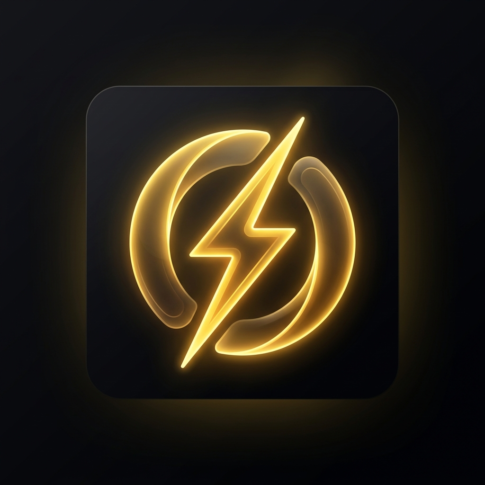

<div align="center">
  
  <h1>Opago Wallet</h1>
  <p><b>Bridging Decentralized Finance with Institutional Compliance.</b></p>
  <p><i>A next-generation mobile POS & consumer wallet built for European regulatory reality.</i></p>
</div>

---

## 🏆 Hackathon Showcase: The Future of Compliant Crypto Payments

For this hackathon, we set out to solve the two biggest blockers preventing cryptocurrency from achieving mainstream retail adoption in Europe: **Fragmented Payment Networks** and **Strict Regulatory Compliance (MiCA / Travel Rule)**.

We transformed the Opago Wallet into a next-generation Point of Sale (POS) consumer app that abstracts away all blockchain complexity while cryptographically ensuring regulatory compliance in the background.

---

### 🌍 The Problem

1. **The Checkout Nightmare:** Today, a merchant who wants to accept Bitcoin, Solana, and USDC has to generate three different QR codes, ask the customer which chain they use, and manage multiple POS integrations. The UX is terrible.
2. **The Compliance Wall:** Under the EU's strict Travel Rule, any crypto transfer exceeding €1,000 (or involving unhosted wallets) requires KYC data to be transmitted alongside the transaction. Doing this at a physical checkout counter usually means forcing the user to fill out tedious web forms while a line of angry customers waits behind them.

### 💡 The Opago Solution

We built a unified wallet experience that solves both problems instantly with a single scan. By combining **OpenCryptoPay (OCP)** for cross-chain negotiation and the **German eIDAS (AusweisApp)** for zero-knowledge identity verification, we created a magical retail checkout experience.

---

## 🔥 Feature Deep Dive 1: OpenCryptoPay (OCP) Cross-Chain Settlements

**The Magic:** Merchants no longer need to care about what blockchain the customer is using. They generate **one single, unified QR code** via our OpenCryptoPay POS integration. 

When the user scans this code with the Opago Wallet, the app dynamically negotiates the available payment methods with the merchant's server. The user is instantly presented with a beautiful, native UI allowing them to settle the invoice using their preferred asset:
*   ⚡ **Lightning Network (SATs)** for instant micro-transactions.
*   🌊 **Solana Native (SOL)** for high-speed Layer 1 settlement.
*   💵 **USDC on Solana** for stablecoin payments.

The wallet automatically calculates real-time network fees and FX rates, executing the swap and settlement in under 400 milliseconds using the **Atomiq SDK** and **Spark SDK**.

<div style="display: flex; justify-content: center; flex-wrap: wrap; gap: 20px; margin-top: 15px; margin-bottom: 25px;">
  <div align="center">
    <p><b>1. Merchant Terminal</b></p>
    
  </div>
  <div align="center">
    <p><b>2. Wallet Negotiation</b></p>
    
  </div>
  <div align="center">
    <p><b>3. Multi-Asset Selection</b></p>
    
  </div>
</div>

---

## 🛡️ Feature Deep Dive 2: eIDAS & Travel Rule Compliance via NFC

**The Magic:** How do you perform a legally binding KYC check in 5 seconds at a coffee shop? You use the ID card the user already has in their pocket.

We deeply integrated the **official German AusweisApp** (eIDAS infrastructure) directly into the wallet's Lightning (LNURL) payment flow. 

**The Technical Architecture:**
1. The user scans a QR code from a strictly regulated merchant.
2. The Opago Wallet parses the LNURL payload and detects a hidden `compliance: { isSubjectToTravelRule: true }` flag.
3. Instead of asking for payment, the wallet **intercepts the flow** and launches the AusweisApp via Android Deep Links.
4. The user holds their National ID Card to the back of their phone (NFC) and enters a 6-digit PIN.
5. The official BVA (Bundesverwaltungsamt) server verifies the identity securely.
6. **The "Magic Moment":** The user swipes back to the Opago Wallet. Our custom `AppState` listener detects the foreground transition, silently fetches the cryptographic identity proof from the backend (signed via Ed25519), and seamlessly attaches it to the final Lightning payment payload.

The merchant receives the funds *and* the legally required Travel Rule data simultaneously. No forms, no waiting, 100% compliant.

<div style="display: flex; justify-content: center; flex-wrap: wrap; gap: 20px; margin-top: 15px; margin-bottom: 25px;">
  <div align="center">
    <p><b>1. NFC ID Scan</b></p>
    
  </div>
  <div align="center">
    <p><b>2. Cryptographic Settlement</b></p>
    
  </div>
</div>

---

## 🛠️ Tech Stack & Integrations

The project relies on a modern toolkit optimized for React Native, Web3, and Enterprise Compliance:

- **Framework:** [Expo](https://expo.dev/) & [React Native](https://reactnative.dev/) (Native iOS & Android)
- **Blockchain:** [Solana Web3.js](https://solana.com/)
- **Cross-Chain / Swaps:** [Atomiq SDK](https://atomiqlabs.com/) for seamless SOL <-> SATs liquidity
- **Lightning Infrastructure:** [Spark SDK](https://spark.build/)
- **Authentication:** [Privy](https://privy.io/) for embedded wallet creation
- **Compliance Integration:** German eIDAS (AusweisApp / Governikus)
- **Routing:** Expo Router for fluid, file-based navigation

---

## 🚀 Running the Hackathon Demo Locally

Want to run the exact demo we showed on stage? Follow these steps:

### Prerequisites
- Node.js (v18+)
- Android device with USB Debugging enabled (for the NFC AusweisApp flow)
- Expo Go (or development build)

### 1. Start the Wallet App
```bash
git clone https://github.com/opago-pay/opago-wallet.git
cd opago-wallet
npm install
npx expo start
```
*Press `a` to open on your connected Android device.*

### 2. Start the Demo Servers (in split terminals)

**Terminal A: The Compliance Backend (eIDAS Provider)**
```bash
node opago_eid_backend.js
```
*(Leave this running to handle Ed25519 cryptographic signatures!)*

**Terminal B: The Merchant Terminal (OpenCryptoPay & eIDAS)**
For the OCP Multi-Chain Demo:
```bash
node scratch_ocp_server.js
```
For the Travel Rule NFC Demo:
```bash
node scratch_eidas_server.js
```

Scan the QR codes printed in your terminal using the Opago Wallet app to experience the magic firsthand!

---

<div align="center">
  <p>Built with ❤️ by the Opago Team</p>
</div>
