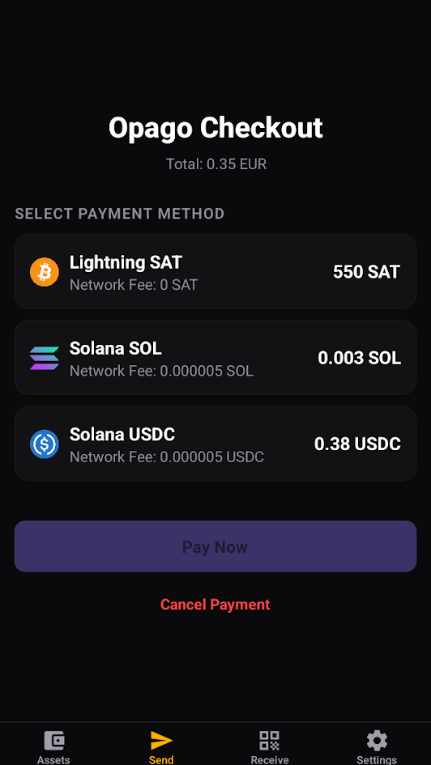
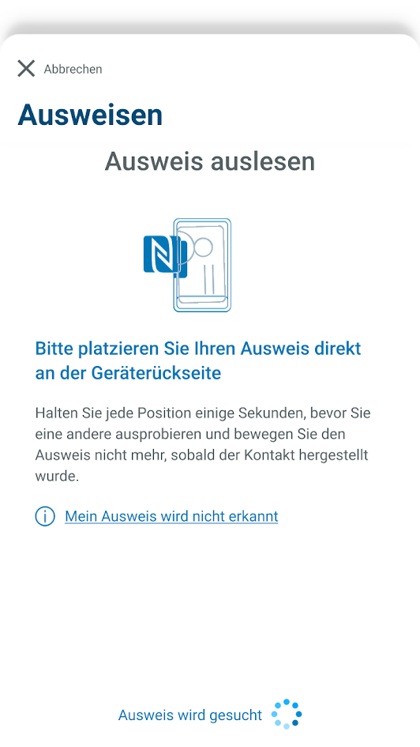
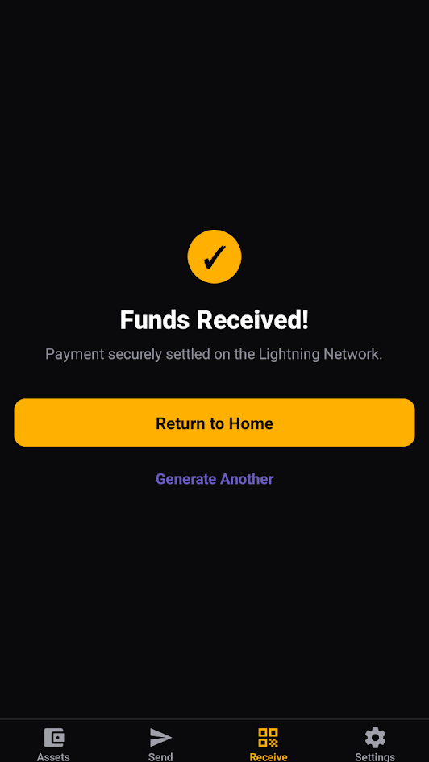
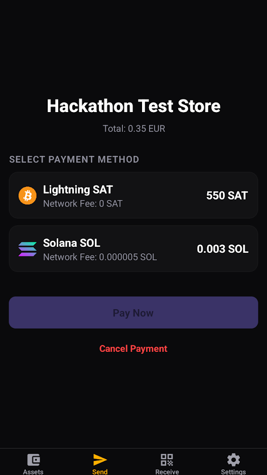
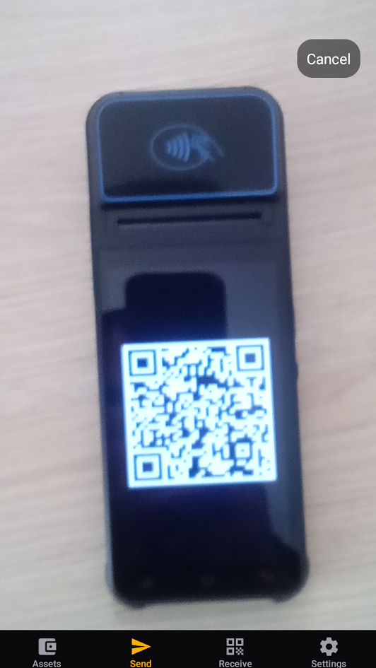

# Opago Wallet Hackathon

Welcome to the **Opago Wallet**! This project was built for a hackathon and is a powerful, crypto-native mobile wallet built with React Native and Expo. 

Our hackathon focus was to bridge the gap between decentralized finance and strict regulatory compliance. We successfully integrated two major features:
1. **OpenCryptoPay (OCP) Cross-Chain Payments:** Scan a single QR code and dynamically choose your preferred currency (e.g., Lightning, Solana, or USDC) to settle invoices instantly.
2. **eIDAS / Travel Rule Compliance:** The wallet integrates seamlessly with the official German **AusweisApp**. For regulated merchants, scanning a payment QR code will automatically trigger an NFC ID card check to instantly provide KYC/Travel Rule cryptographic proofs over the Lightning Network.

## Features

- **Built for Mobile:** Native iOS and Android experiences using Expo and React Native.
- **Crypto-Native:** Integrated tightly with Solana Web3 to handle decentralized interactions.
- **Spark & Atomiq Integrations:** Leveraging `@buildonspark/spark-sdk` and `@atomiqlabs/sdk` for lightning-fast capability and cross-chain mechanics.
- **Privy Authentication:** Seamless onboarding and wallet management via `@privy-io/expo`.
- **Modern UI:** Built using `expo-router` for file-based routing and bottom tabs for navigation.

## Tech Stack

The project relies on a modern toolkit optimized for React Native and Web3:
- **Framework:** [Expo](https://expo.dev/) & [React Native](https://reactnative.dev/)
- **Blockchain:** [Solana Web3](https://solana.com/)
- **SDKs:** [Spark SDK](https://spark.build/), [Atomiq Labs](https://atomiqlabs.com/)
- **Authentication:** [Privy](https://privy.io/)
- **Routing:** Expo Router
- **Language:** TypeScript

## Getting Started

### Prerequisites

You will need the following installed:
- [Node.js](https://nodejs.org/en/) (LTS recommended)
- npm or yarn

### Installation

1. Clone the repository and navigate to the project directory:
   ```bash
   cd opago-wallet-hackathon
   ```
2. Install the dependencies:
   ```bash
   npm install
   ```

### Running the App

Start the Expo development server:

```bash
npx expo start
```

Press **`i`** to open the app on an iOS simulator, **`a`** to open on an Android emulator, or scan the QR code with the **Expo Go** app on your physical device.

## Project Structure

- **`app/`**: Contains the file-based routing structure using Expo Router.
- **`components/`**: Reusable UI components.
- **`lib/`**: Core utilities, including blockchain setups (e.g., Spark SDK).
- **`assets/`**: Static images, fonts, and other resources.

## License

MIT License

---

## Hackathon Demo & Screenshots

Here is a glimpse of the Opago Wallet in action during our pitch demo:

<div style="display: flex; flex-wrap: wrap; gap: 10px;">
  
  
  
  
  
</div>
